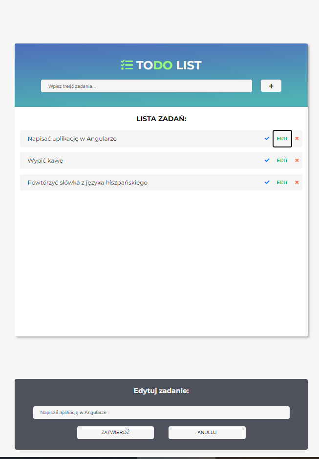

# toDoApp
JavaScript Application which enables you to create a toDo list of tasks you have to manage and finish.

Additional information:
You can add, edit and delete any of the tasks. Also application is checking if you are not adding an empty task as well as editing the task with an empty string.

Screenshot of running application:

